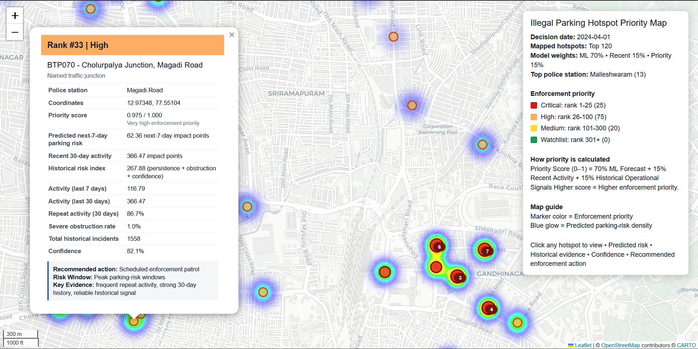

# 🚓 Parking Enforcement Intelligence
### Gridlock Hackathon 2.0 — Round 2

<p align="center">
  
</p>

An AI-powered decision-support system that predicts illegal parking hotspots and prioritizes enforcement using machine learning, historical trends, spatial context, and explainable risk scoring.

---

## Problem

Illegal parking near markets, metro stations, commercial corridors, and major junctions reduces road capacity and increases congestion.

Current enforcement is largely reactive:
- patrols are manually scheduled,
- historical trends are difficult to interpret,
- resources cannot be prioritized effectively.

This project transforms historical violation records into **ranked enforcement hotspots with recommended actions**, enabling proactive deployment.

---

## Key Features

✅ Spatial hotspot detection using named junctions + H3 hexagonal cells

✅ Walk-forward machine learning forecasting

✅ Spatial neighborhood awareness using BallTree

✅ Explainable ensemble priority score

✅ Automated enforcement recommendations

✅ Interactive hotspot visualization

---

## Methodology

### 1. Spatial aggregation

Violation records are grouped into:

- Named traffic junctions (preferred)
- H3 hexagonal cells (resolution 9)
- Latitude/longitude grid fallback

creating stable spatial enforcement units.

---

### 2. Feature engineering

For every spatial unit and day:

- 1 / 7 / 14-day lag features
- 7 / 14 / 30-day rolling statistics
- persistence signals
- obstruction severity
- momentum indicators
- historical confidence
- neighborhood activity (0.5 km BallTree search)

---

### 3. Walk-forward forecasting

Instead of a single train/test split, the model is evaluated using expanding time windows.

```
Train ─────────► Validate
Train + Validate1 ─────────► Validate2
Train + Validate1 + Validate2 ─────────► Validate3
```

This better reflects real deployment where future observations are unavailable during training.

---

### 4. Ensemble priority scoring

Final hotspot priority combines multiple signals:

| Component | Weight |
|------------|---------|
| ML forecast | **70%** |
| Recent activity | **15%** |
| Historical operational signals | **15%** |

The resulting **Priority Score (0–1)** is converted into:

- 🔴 Critical
- 🟠 High
- 🟡 Medium
- 🟢 Watchlist

---

## Interactive Dashboard

The generated Folium dashboard provides:

- Priority-ranked hotspots
- Spatial heatmap
- Historical evidence
- Confidence score
- Recommended enforcement action
- Suggested enforcement window

---

## Repository Structure

```
.
├── notebooks/
│   └── parking_enforcement_pipeline.ipynb

├── data/
│   └── README.md

├── outputs/
│   ├── final_hotspots.csv
│   └── parking_hotspot_map.html

├── requirements.txt
└── README.md
```

---

## Setup

```bash
git clone https://github.com/<username>/<repo>.git

cd <repo>

pip install -r requirements.txt
```

Place the raw violation dataset inside

```
data/
```

or next to the notebook and run

```
notebooks/parking_enforcement_pipeline.ipynb
```

from top to bottom.

---

## Outputs

### outputs/final_hotspots.csv

Contains:

- hotspot rank
- enforcement tier
- coordinates
- priority score
- historical confidence
- recommended action
- recommended enforcement window

---

### outputs/parking_hotspot_map.html

Interactive visualization with:

- 🔴🟠🟡 Marker color → Enforcement priority
- 🔵 Heat layer → Predicted parking-risk density
- 🔢 Marker size → Relative hotspot importance

Click any hotspot to view detailed model evidence and operational recommendations.

---

## Tech Stack

- Python
- Pandas
- NumPy
- Scikit-learn
- Folium
- BallTree
- H3

---

## Future Improvements

- Real-time traffic integration
- Live CCTV / IoT parking feeds
- Dynamic patrol routing
- Enforcement impact simulation
- City-scale deployment API

---

## Hackathon

Built for **Gridlock Hackathon 2.0 – Round 2** as an explainable AI decision-support system for intelligent parking enforcement.